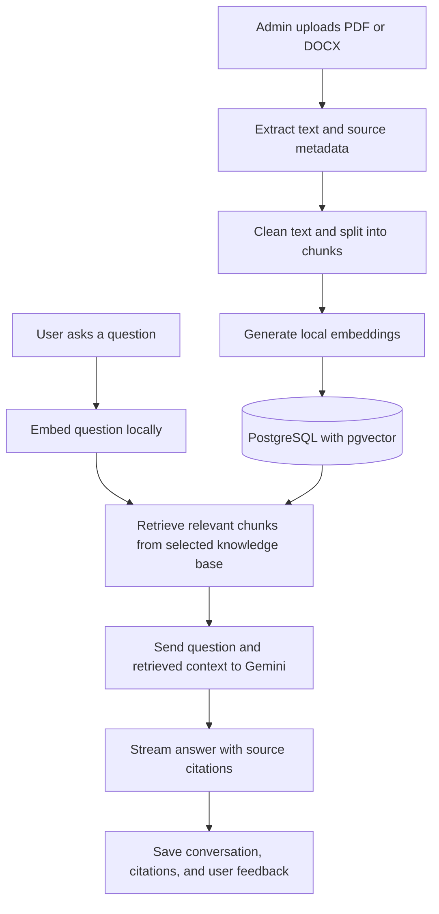

# Knowledge Assistant

An AI assistant that helps you ask questions about your documents and explore the sources behind its answers. Upload documents into a knowledge base, ask a question, and review the retrieved evidence alongside the response.

## Why I’m building this

I’m building Knowledge Assistant to learn how to design and develop an AI assistant using retrieval-augmented generation (RAG). This project explores the complete workflow: processing documents, generating embeddings, retrieving relevant information, and producing answers with source citations.

RAG means finding relevant information from your documents and giving that information to an AI model as context for an answer. This project is a learning project with working document management, retrieval, and chat workflows.

## Contents

- [Current features](#current-features)
- [How it works](#how-it-works)
- [Quick start with Docker](#quick-start-with-docker)
- [Your first conversation](#your-first-conversation)
- [Local developer setup](#local-developer-setup)
- [Configuration](#configuration)
- [Troubleshooting](#troubleshooting)
- [Project structure and documentation](#project-structure-and-documentation)
- [Contributing](#contributing)
- [Limitations](#limitations)
- [License](#license)

## Current features

- Create and manage knowledge bases: collections of documents used together for retrieval and chat.
- Upload text-based PDF and DOCX files, process them into searchable chunks, and reprocess documents when needed.
- Inspect retrieved chunks in the admin Retrieval Lab before asking the assistant to generate an answer.
- Chat with streaming responses, source citations, and an insufficient-evidence response when retrieval does not provide usable context.
- Preview original PDFs and DOCX files, or download the original documents.
- Reopen saved conversations with their sources and give thumbs-up or thumbs-down feedback.
- Sign in with role-based access for users, admins, and superadmins.

The stack uses Next.js, React, and Tailwind CSS for the frontend; FastAPI, SQLAlchemy, and Alembic for the backend; PostgreSQL 16 with pgvector for storage and vector search; Sentence Transformers for local embeddings; and Gemini for answer generation.

## How it works



1. **Ingest:** the API stores the original document, extracts its text, and splits it into smaller passages called chunks. Processing runs synchronously during upload or reprocessing. A document becomes `processed` when indexing succeeds, or `failed` if processing cannot finish.
2. **Index:** a local embedding model turns each chunk into a numerical representation of its meaning. These vectors and source metadata are stored in PostgreSQL using pgvector. Original files are stored separately on disk.
3. **Retrieve:** the same embedding model represents the question, and vector search finds related chunks within the selected knowledge base.
4. **Answer:** usable retrieved context and the question are sent to Gemini. If there is no usable evidence, the assistant returns an insufficient-evidence response instead of requesting an answer from the model.
5. **Inspect:** citations connect the answer to source chunks and original documents. Conversations, citations, and submitted feedback are persisted.

Embeddings run locally. Answer generation uses an external Gemini service, so the question and retrieved document excerpts leave your machine. PDF sources retain page references; DOCX sources retain block metadata without fixed page numbers.

## Quick start with Docker

### Prerequisites

- Git.
- Docker with the Docker Compose v2 command (`docker compose`). Docker Desktop includes both.
- A Gemini API key with access to the configured model.
- Internet access to download dependencies, the embedding model, and call Gemini.
- Available local ports `3000`, `8000`, and `5432`.

You do not need Python or Node.js installed on your host for this setup.

### 1. Clone and configure

```bash
git clone https://github.com/developedbyjose/knowledge-assistant.git
cd knowledge-assistant
cp .env.example .env
```

Open the root `.env` in your editor and set your own key:

```dotenv
GEMINI_API_KEY=your_gemini_api_key_here
```

Keep your real key in the ignored `.env` file. Never commit it.

### 2. Start the stack

Run from the repository root:

```bash
docker compose up --build -d
docker compose ps
```

Compose starts the database, API, and frontend. The API automatically applies Alembic migrations before serving requests, and the frontend waits for the API health check to pass. The initial build can take a while because the backend includes local machine-learning dependencies.

### 3. Create your first account

Once the API is running, execute this from the repository root:

```bash
docker compose exec api python -m app.cli.create_superadmin
```

Enter an email, display name, and password when prompted. The password must contain 12–128 characters; password entry is hidden. There is no default login account. Account creation requires the migrated database.

### 4. Open the application

| Service | Local address |
| --- | --- |
| Application / sign in | [localhost:3000/login](http://localhost:3000/login) |
| Chat | [localhost:3000/chat](http://localhost:3000/chat) |
| Admin Retrieval Lab | [localhost:3000](http://localhost:3000) |
| API health | [localhost:8000/health](http://localhost:8000/health) |
| Interactive API documentation | [localhost:8000/docs](http://localhost:8000/docs) |

The health endpoint reports whether a Gemini key is configured; a healthy API does not confirm that the key has valid quota or model access. Protected API operations require an authenticated session.

To view logs or stop the stack, run from the repository root:

```bash
docker compose logs -f api web
docker compose down
```

Normal shutdown preserves named volumes for database data, uploaded files, and the embedding-model cache. Adding `--volumes` to the shutdown command deletes those volumes and their contents.

## Your first conversation

1. Sign in using the superadmin account you created.
2. Open the admin Retrieval Lab at `/` and create or select a knowledge base.
3. Upload a text-based PDF or DOCX file and wait for its status to become `processed`. The first upload may take longer while the local embedding model downloads.
4. Optionally run a retrieval query in the lab to inspect the matching chunks.
5. Ensure the knowledge base is marked **Active for chat**, then open `/chat` and select it.
6. Ask a question that the uploaded document can answer. Inspect the source panel and open a citation to preview the original document.
7. Submit feedback on the assistant response, or reopen the conversation later.

| Role | Access |
| --- | --- |
| User | Chat with active knowledge bases, inspect accessible sources, and manage their own conversations. |
| Admin | User capabilities plus knowledge-base and document management. |
| Superadmin | Admin capabilities plus account management at `/users`. |

Superadmins create additional accounts with temporary passwords. Those users must change their password after signing in. Conversations belong to the user who created them, including when that user is an admin.

## Local developer setup

Use this path to run the API and frontend directly on your machine while PostgreSQL runs in Docker. These commands use a macOS/Linux shell; on Windows, use the equivalent virtual-environment activation command.

Install Git, Docker Compose, **Python 3.12**, **Node.js 22**, and **pnpm 10.14.0**, matching the container runtimes. Clone the repository as above. Run only the database service to avoid port conflicts with local servers:

```bash
# From the repository root
docker compose up -d db
docker compose ps db
```

Wait for the database to be healthy before applying migrations.

### Backend — terminal 1

```bash
# From the repository root
cd apps/api
python3.12 -m venv .venv
source .venv/bin/activate
python -m pip install -r requirements.txt
cp ../../.env.example .env
```

Set `GEMINI_API_KEY` in `apps/api/.env`. Keep the example `DATABASE_URL` using `localhost:5432`, because this API runs on the host. Settings read `.env` from the working directory, so run API commands from `apps/api`.

```bash
# From apps/api, with the virtual environment active
alembic upgrade head
python -m app.cli.create_superadmin
uvicorn app.main:app --reload --host 127.0.0.1 --port 8000
```

If you already created an account in the same database, use that account instead of creating it again. Local Uvicorn startup does not apply migrations automatically.

### Frontend — terminal 2

```bash
# From the repository root
cd apps/web
corepack enable
corepack prepare pnpm@10.14.0 --activate
pnpm install --frozen-lockfile
pnpm dev
```

The frontend defaults to `http://localhost:8000/api/v1`. If the API address changes, create `apps/web/.env.local` with the appropriate `NEXT_PUBLIC_API_URL` and restart the frontend. Use `localhost` consistently in your browser for the configured cookie and CORS behavior.

Open [localhost:3000/login](http://localhost:3000/login) and follow the first-conversation steps above.

## Configuration

The root `.env.example` lists backend defaults. There are two different configuration paths:

- **Docker Compose:** the root `.env` supplies values referenced by `${...}` in `docker-compose.yml`, including the Gemini key and upload limits. Other API settings, such as `LLM_MODEL`, are explicitly set in the Compose file; changing them only in the root `.env` does not override those values. Edit the service environment in Compose and recreate the affected service.
- **Local API:** `apps/api/.env` supplies backend settings when commands run from `apps/api`. Environment variables exported in the shell take precedence.

| Setting | Purpose / current default |
| --- | --- |
| `GEMINI_API_KEY` | Your provider key; required for Gemini answer generation. |
| `LLM_PROVIDER` / `LLM_MODEL` | Currently `gemini` / `gemini-flash-lite-latest`. Availability depends on your provider account. |
| `EMBEDDING_PROVIDER` / `EMBEDDING_MODEL` | `local` / `sentence-transformers/all-MiniLM-L6-v2`. |
| `EMBEDDING_DIMENSIONS` | `384`, matching the current embedding model and vector schema. |
| `DATABASE_URL` | Uses `localhost` for a host API and `db` for the Compose API. |
| `UPLOAD_DIR` | Original-file storage; defaults to `uploads`, backed by a named volume in Compose. |
| `MAX_UPLOAD_BYTES` | `26214400` bytes (25 MiB) per uploaded file. |
| `MAX_DOCX_UNCOMPRESSED_BYTES` | `104857600` bytes (100 MiB) for expanded DOCX archive content. |
| `RETRIEVAL_MIN_SIMILARITY_SCORE` | `0.05`; controls whether retrieved evidence is usable for generation. |
| `CORS_ORIGINS` | Allowed frontend origins; defaults to `http://localhost:3000`. |
| `SESSION_COOKIE_SECURE` | `false` for local HTTP development. |
| `SESSION_LIFETIME_DAYS` | `7`. |
| `NEXT_PUBLIC_API_URL` | Public frontend API address; defaults to `http://localhost:8000/api/v1`. Never put secrets in `NEXT_PUBLIC_*` settings. |

Changing the embedding model requires checking vector dimensions and reindexing existing documents. The configured provider factories currently support local embeddings and Gemini chat.

Compose runs a development frontend and publishes local service ports with example database credentials. A deployed environment needs HTTPS, `SESSION_COOKIE_SECURE=true`, exact frontend CORS origins, and appropriately restricted database access and credentials.

## Troubleshooting

| Problem | What to check |
| --- | --- |
| Containers are starting slowly | Run `docker compose ps` and `docker compose logs -f api web` from the repository root. The first build installs substantial backend dependencies. |
| Missing Gemini key | Set the key in the correct environment file. For Compose, run `docker compose up -d --force-recreate api` after updating it. For a local API, restart Uvicorn. |
| Gemini quota or model error | Check the provider error, your key’s quota, and access to the configured model. Update `LLM_MODEL` through the configuration path above if necessary. |
| First upload takes longer | The embedding model downloads on first use. Check network access; Compose retains the model cache between normal restarts. |
| Port already in use | Stop the conflicting service or change the host port mapping. Update API URLs, host database connections, and CORS settings as needed. |
| Login works but no knowledge base is available in chat | An admin must activate a knowledge base and process its documents. |
| Document processing fails | Check the displayed processing error and API logs. Use a supported, extractable-text file within the upload limits, then reprocess it if appropriate. |
| Assistant has insufficient evidence | Verify that documents processed successfully, select the intended knowledge base, and use the Retrieval Lab to inspect matches for the question. |
| Database tables are missing | For Compose, run `docker compose run --rm api alembic upgrade head`. For a host API, run `alembic upgrade head` from `apps/api` with its environment active. |

See [database operations](docs/database.md) for PostgreSQL access, migration inspection, and additional troubleshooting.

## Project structure and documentation

```text
knowledge-assistant/
├── apps/
│   ├── api/                 # FastAPI, persistence, RAG, migrations, and tests
│   └── web/                 # Next.js routes, components, and browser API client
├── docs/                    # Architecture, API, database, and retrieval guides
├── .env.example             # Example backend configuration
└── docker-compose.yml       # Local database, API, and frontend orchestration
```

Backend routes call services, which coordinate repositories and RAG providers. The frontend accesses the versioned `/api/v1` API through `apps/web/src/lib/api.ts`.

- [Architecture](docs/architecture.md): application boundaries, data flow, and authentication.
- [API reference](docs/api.md): endpoints, contracts, and streaming behavior.
- [Database operations](docs/database.md): PostgreSQL setup, migrations, and inspection.
- [Retrieval and evaluation](docs/retrieval-evaluation.md): ingestion, retrieval behavior, fixtures, and quality checks.

## Contributing

Issues and pull requests are welcome. For a bug report, include reproduction steps, expected behavior, and relevant errors without API keys, passwords, or private document content.

Read [the repository guidance](AGENTS.md) and the instructions inside the app you are changing. Keep changes focused, update related documentation, and test the affected behavior.

Run backend tests from `apps/api` with the virtual environment active:

```bash
python -m pytest tests
```

Run frontend checks from `apps/web` after installing dependencies:

```bash
pnpm lint
pnpm build
```

Backend tests include provider fakes; these commands do not constitute a live Gemini or full-stack setup test. Follow any test-specific environment requirements when adding integration coverage.

## Limitations

- Ingestion supports text-based PDF and DOCX. Legacy DOC files and image-only documents requiring OCR are not supported.
- DOCX ingestion reads body paragraphs and table text; it does not ingest headers, footers, comments, embedded-image OCR, or tracked-change details.
- DOCX page numbering is not stored, and browser previews can differ from Microsoft Word. Downloads preserve the original file.
- Document processing is synchronous; large documents can take time to index.
- Answer quality depends on source content, retrieval, and the model. Citations help you inspect the evidence; they do not guarantee a correct answer.
- Gemini generation requires network access and is subject to your provider account’s limits.

## License

This repository currently does not include a license file. Public availability does not grant an open-source license; contact the maintainer to clarify permission for reuse or redistribution.
